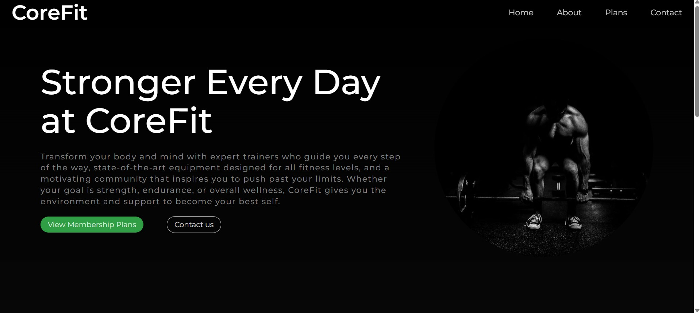

# Front-End-Projects
This repository contains all those projects  that I have created with front end design in mind.

---

## About
In my 3rd year, I realized that there is nothing like the feeling of a good front end design, capable of engaging users in the most obnoxious ways. So I wanted to created projects that would help me learn exactly this. I also had a lot of fun doing these projects. You won't find backend for these projects, and most of them have no utility. It only serves the purpose of learning.

---

## Sceenshots
- Beanora: 

- Fast Fingers:

- Dice Game:

- Gym:

---

## Summary Table: 
| Project Name | Screenshot |
|---|---|
|Beanora||
|Fast Fingers||
|Dice Game||
|Gym||
|Movie Guess||
|SocialMediaVisualizer||
